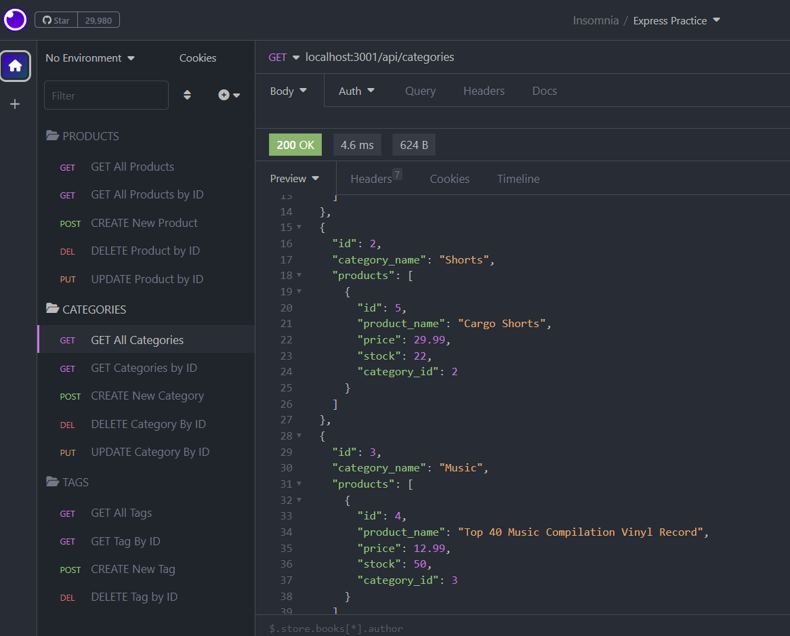

# E-Commerce-Back-End-ORM
UT's Fullstack Flex Web Development Bootcamp - Challenge 13

## Description
E-commerce is an industry thats growing abd requires a service of business to organize the data that it requires. This activity is used to call CRUD fundamentals of create, read, update, and delete routes. We have utilized CMV file structures that include routes, handlebars, seed data, etc. The packages of node include sequelize, express, dotenv. etc. Insomnia was used to check the routes and is shown in the video attatched.

## Usage

https://github.com/mayphamx/E-Commerce-Back-End-ORM
https://drive.google.com/file/d/1pMQY5_OSpGANz_N7N3ev6QbP18tHz69L/view